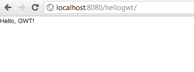

Разрабатываем приложение на Spring и GWT. Часть 2 - Добавляем GWT
-----------------------------------------------------------------
* `hellogwt-2 - Alex Tretyakov Blog`: [http://alextretyakov.blogspot.com/2011/10/spring-gwt-2-gwt.html](http://alextretyakov.blogspot.com/2011/10/spring-gwt-2-gwt.html)
* `hellogwt-2 - Revision 6: /trunk`: [http://hellogwt-2.googlecode.com/svn/trunk/](http://hellogwt-2.googlecode.com/svn/trunk/)
> В процессе написания приложения будут использоваться:
>
>- Spring 3.0.5
>- GWT 2.4.0
>- Maven 3.0.3
>- Tomcat 6.0.33 ([http://localhost:8080/hellogwt/](http://localhost:8080/hellogwt/))

>Для интеграции Spring и GWT мы будем использовать библиотеку [spring4gwt](http://code.google.com/p/spring4gwt/). Её нет в репозитории Maven, поэтому ее нужно скачать [отсюда](http://code.google.com/p/spring4gwt/downloads/list) и добавить в директорию **WEB-INF/lib** нашего проекта.
>Библиотеку [spring4gwt](http://code.google.com/p/spring4gwt/) в проект можно добавить в локальный репозиторий Maven и указать зависимость от нее в **pom.xml**. Для этого нужно в директории с библиотекой выполнить следующую команду:
>
>***mvn install:install-file -Dfile=spring4gwt-0.0.1.jar -DgroupId=com.google.code -DartifactId=spring4gwt -Dversion=0.0.1 -Dpackaging=jar***

>При деплое GWT-проекта на Tomcat вываливается ошибка типа:
>
>- **Error:GWT Compiler: Element 'module' beginning on line 17 contains unexpected attribute 'type'**
>- **Error:GWT Compiler: Failure while parsing XML**
>
>При запуске GWT-проекта в консоли тоже вываливается ошибка типа:

[INFO] One or more required plugin parameters are invalid/missing for 'gwt:run'

[0] Inside the definition for plugin 'gwt-maven-plugin' specify the following:

<configuration>
  ...
  <runTarget>VALUE</runTarget>
</configuration>

-OR-

on the command line, specify: '-DrunTarget=VALUE'
>Перехожу, в консоли, в рабочую папку проекта и запускаю GWT-проекта в режиме **Dev Mode**:
>
> **mvn gwt:run -DrunTarget=hellogwt**
>
>Дальше в веб-броузере перехожу по ссылке: [http://127.0.0.1:8888/](http://127.0.0.1:8888/)

